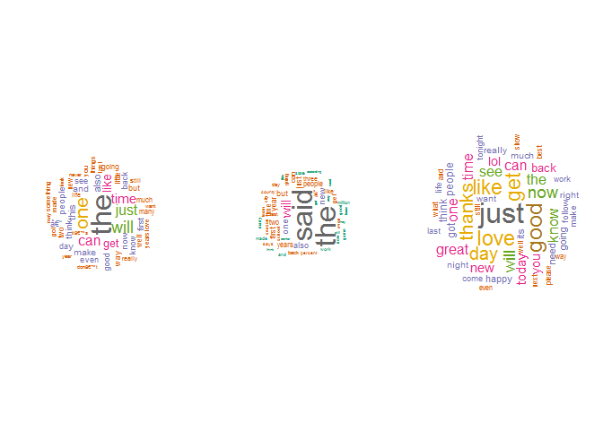
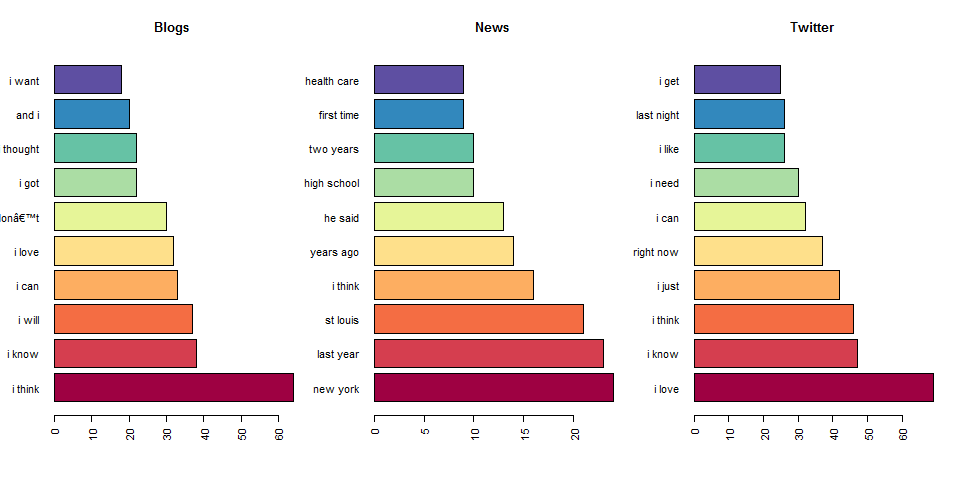
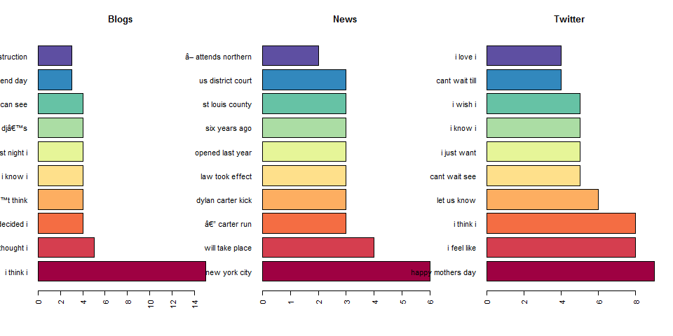

# CapstoneProject
Albert Blanchart  
February 6, 2017  


## Understanding the problem

We will first deal with the first task we need to accomplish for this capstone project based in Natural Language Processing. So lets load some packages we will need for it:

```r
library(ggplot2)
library(stringi)
library(dplyr)
library(tm)
library(RWeka)
library(wordcloud)
library(RColorBrewer)
```
Our second goal is to obtain the file we will work with, this file can be obtained [here](https://d396qusza40orc.cloudfront.net/dsscapstone/dataset/Coursera-SwiftKey.zip) and it is a .zip file conatining several folders with txt files from twitter, blogs and news in 4 different languages. We will first, download the file:

```r
fileURL <- "https://d396qusza40orc.cloudfront.net/dsscapstone/dataset/Coursera-SwiftKey.zip"
if(!file.exists("./Coursera-SwiftKey.zip")) {
  download.file(fileURL, destfile = "./Coursera-SwiftKey.zip")
}
```
Before we extract the content of the file we can actually check it out _(after running this command the file has already been unzipped in the working directory)_:

```
##                             Name    Length                Date
## 1                         final/         0 2014-07-22 10:10:00
## 2                   final/de_DE/         0 2014-07-22 10:10:00
## 3  final/de_DE/de_DE.twitter.txt  75578341 2014-07-22 10:11:00
## 4    final/de_DE/de_DE.blogs.txt  85459666 2014-07-22 10:11:00
## 5     final/de_DE/de_DE.news.txt  95591959 2014-07-22 10:11:00
## 6                   final/ru_RU/         0 2014-07-22 10:10:00
## 7    final/ru_RU/ru_RU.blogs.txt 116855835 2014-07-22 10:12:00
## 8     final/ru_RU/ru_RU.news.txt 118996424 2014-07-22 10:12:00
## 9  final/ru_RU/ru_RU.twitter.txt 105182346 2014-07-22 10:12:00
## 10                  final/en_US/         0 2014-07-22 10:10:00
## 11 final/en_US/en_US.twitter.txt 167105338 2014-07-22 10:12:00
## 12    final/en_US/en_US.news.txt 205811889 2014-07-22 10:13:00
## 13   final/en_US/en_US.blogs.txt 210160014 2014-07-22 10:13:00
## 14                  final/fi_FI/         0 2014-07-22 10:10:00
## 15    final/fi_FI/fi_FI.news.txt  94234350 2014-07-22 10:11:00
## 16   final/fi_FI/fi_FI.blogs.txt 108503595 2014-07-22 10:12:00
## 17 final/fi_FI/fi_FI.twitter.txt  25331142 2014-07-22 10:10:00
```
Now we need to load the files in english (my skills in german, russian and finnish are a bit puuuff):

```r
en_twitter <- readLines("./final/en_US/en_US.twitter.txt", skipNul = TRUE)
en_blogs <- readLines("./final/en_US/en_US.blogs.txt", skipNul = TRUE)
en_news <- readLines("./final/en_US/en_US.news.txt", skipNul = TRUE)
```
This script above will take a lot of time to compute, if we mean to use the whole file and the loaded data in R. So why not to **sub-sample dataset** by reading in a random subset of the original data and writing it out to a separate file, so our computers won't go crazy. Therefore we will use connections to read random chunks of the file (do not forget to set seed ;D)  


```r
set.seed(1234)
con <- file("./final/en_US/en_US.blogs.txt")
en_blogs <- sample(readLines(con = con, skipNul = TRUE), size = .002*length(readLines(con = con, skipNul = TRUE)), replace = FALSE)
close(con)
```

We have already done the same code with the other two datasets (if you want to see the full code just check [my Github](https://github.com/Changomazo/Tokenization) repository) exactly the same with the other two datasets, so we will have 0.2% of each data set: *en_blogs*, *en_news* and *en_twitter*. So we will be dealing with 1798, 1545 and 4720 elements respectively.  


## Exploring the data  
If we take a closer look to our samples, we can explore the different data bases we have just created by loading in R and sampling the original files. To this end we will be using the package *stringi* to find out more about our data sets:
<table>
 <thead>
  <tr>
   <th style="text-align:left;"> Source </th>
   <th style="text-align:right;"> Lines </th>
   <th style="text-align:right;"> Words </th>
   <th style="text-align:right;"> Characters </th>
   <th style="text-align:right;"> Words_per_Line </th>
   <th style="text-align:right;"> Char_per_Line </th>
   <th style="text-align:right;"> Char_per_Word </th>
  </tr>
 </thead>
<tbody>
  <tr>
   <td style="text-align:left;"> en_blogs </td>
   <td style="text-align:right;"> 8992 </td>
   <td style="text-align:right;"> 378840 </td>
   <td style="text-align:right;"> 1718765 </td>
   <td style="text-align:right;"> 42.13 </td>
   <td style="text-align:right;"> 191.14 </td>
   <td style="text-align:right;"> 4.54 </td>
  </tr>
  <tr>
   <td style="text-align:left;"> en_news </td>
   <td style="text-align:right;"> 10102 </td>
   <td style="text-align:right;"> 348837 </td>
   <td style="text-align:right;"> 1706482 </td>
   <td style="text-align:right;"> 34.53 </td>
   <td style="text-align:right;"> 168.93 </td>
   <td style="text-align:right;"> 4.89 </td>
  </tr>
  <tr>
   <td style="text-align:left;"> en_twitter </td>
   <td style="text-align:right;"> 23601 </td>
   <td style="text-align:right;"> 300109 </td>
   <td style="text-align:right;"> 1339138 </td>
   <td style="text-align:right;"> 12.72 </td>
   <td style="text-align:right;"> 56.74 </td>
   <td style="text-align:right;"> 4.46 </td>
  </tr>
</tbody>
</table>
In order to do a proper analysis of the most common words appearing in each of our data sets and the frequencies of 2- and 3-grams in each data set, we need to do some serious cleaning. Thus, using the package _tm_ we will remove some of the elements we do not need for the analysis and that might potentially ruin it _(NOTE: we are just showing one of the three databases)_:


```r
en_blogs_txt <- VCorpus(VectorSource(en_blogs)) 
en_blogs_txt <- tm_map(en_blogs_txt,removeNumbers) 
en_blogs_txt <- tm_map(en_blogs_txt,removeWords, stopwords("english"))
en_blogs_txt <- tm_map(en_blogs_txt,stripWhitespace) 
en_blogs_txt <- tm_map(en_blogs_txt, content_transformer(tolower)) 
en_blogs_txt <- tm_map(en_blogs_txt, removePunctuation,preserve_intra_word_dashes = TRUE)
```


Now that our datasets are _clean_ we can proceed to tokenize or **the process of breaking our datasets of text up into words, phrases, symbols, or other meaningful elements called tokens**. We will do 1, 2 and 3 grams analysis that it we will break the texts in en_blogs_txt, en_news_txt and en_twitter_txt into one, two or three words and check the frequency of these 1, 2 and 3 word sentences in the text. We will use pretty standard tokenize functions for this:


```r
OneToken<-function(x)NGramTokenizer(x, Weka_control(min = 1, max = 1))
TwoToken<-function(x)NGramTokenizer(x, Weka_control(min = 2, max = 2))
ThreeToken<-function(x)NGramTokenizer(x, Weka_control(min = 3, max = 3))
unigrams<-function(x)
  {tdm <- TermDocumentMatrix(x, control = list(tokenize = OneToken))
   fm <- rowSums(as.matrix(tdm))
   ngram<-data.frame(ngram=names(fm),freq=fm)
   ngram<-ngram[order(-ngram$freq),]
}
bigrams<-function(x)
  {tdm <- TermDocumentMatrix(x, control = list(tokenize = TwoToken))
   fm <- rowSums(as.matrix(tdm))
   ngram<-data.frame(ngram=names(fm),freq=fm)
   ngram<-ngram[order(-ngram$freq),]
}
trigrams<-function(x)
  {tdm <- TermDocumentMatrix(x, control = list(tokenize = ThreeToken))
   fm <- rowSums(as.matrix(tdm))
   ngram<-data.frame(ngram=names(fm),freq=fm)
   ngram<-ngram[order(-ngram$freq),]
}
```

Now we apply the functions to our _clean_ datasets:  


```r
en_blogs1 <- unigrams(en_blogs_txt)
en_news1 <- unigrams(en_news_txt)
en_twitter1 <- unigrams(en_twitter_txt)
en_blogs2 <- bigrams(en_blogs_txt)
en_news2 <- bigrams(en_news_txt)
en_twitter2 <- bigrams(en_twitter_txt)
en_blogs3 <- trigrams(en_blogs_txt)
en_news3 <- trigrams(en_news_txt)
en_twitter3 <- trigrams(en_twitter_txt)
```

1. Frequencies of 1-grams in our three datasets, en_blogs_txt, en_news_txt and en_twitter_txt: 


```r
par(mfrow = c(1, 3))
wordcloud(en_blogs1$ngram, en_blogs1$freq, scale = c(3, .1), max.words = 50, random.order = FALSE, rot.per = .5, use.r.layout = FALSE, colors = brewer.pal(8, "Dark2"))
wordcloud(en_news1$ngram, en_news1$freq, scale = c(3, .1), max.words = 50, random.order = FALSE, rot.per = .5, use.r.layout = FALSE, colors = brewer.pal(8, "Dark2"))
wordcloud(en_twitter1$ngram, en_twitter1$freq, scale = c(3, .1), max.words = 50, random.order = FALSE, rot.per = .5, use.r.layout = FALSE, colors = brewer.pal(8, "Dark2"))
```

<!-- -->

Looking at the wordclods created from the 1-gram structures in blogs, news and twitter, seem pretty obvious in the first two that *the* word is the most frequent 1-gram, on the other hand in the twitter tokenized data base, seems to present a bit more equal frequencies.

2. Next, we will explore the frequencies of the 2-grams in our databases:

```r
par(mfrow = c(1, 3))
barplot(en_blogs2[1:10,2], col = brewer.pal(10, "Spectral"), names.arg = en_blogs2$ngram[1:10], horiz = TRUE, las = 2, main = "Blogs")
barplot(en_news2[1:10,2], col = brewer.pal(10, "Spectral"), names.arg = en_news2$ngram[1:10], horiz = TRUE, las = 2, main = "News")
barplot(en_twitter2[1:10,2], col = brewer.pal(10, "Spectral"), names.arg = en_twitter2$ngram[1:10], horiz = TRUE, las = 2, main = "Twitter")
```

<!-- -->

3. And now for the 3-grams:

```r
par(mfrow = c(1, 3))
barplot(en_blogs3[1:10,2], col = brewer.pal(10, "Spectral"), names.arg = en_blogs3$ngram[1:10], horiz = TRUE, las = 2, main = "Blogs")
barplot(en_news3[1:10,2], col = brewer.pal(10, "Spectral"), names.arg = en_news3$ngram[1:10], horiz = TRUE, las = 2, main = "News")
barplot(en_twitter3[1:10,2], col = brewer.pal(10, "Spectral"), names.arg = en_twitter3$ngram[1:10], horiz = TRUE, las = 2, main = "Twitter")
```

<!-- -->

So we can see which words, 2 and 3 word sentences appear more frequently in our samples from the text files. The frequencies of one-term (gram), are way higher than the other two which is completely normal since terms can combine in multiple ways (specially the 3-terms) thus decreasing the frequencies.

## Some interesting facts
### How many unique words do you need in a frequency sorted dictionary to cover 50% of all word instances in the language? 90%?  
To figure out this question we will do a cumulative sum of the frequencies of all databases together and use one of our gram function, _unigram(x)_ to extract the frequencies of single words in all texts:  


```r
allinone <- c(en_blogs_txt, en_news_txt, en_twitter_txt)
allinonegrams <- unigrams(allinone)
percentage <- cumsum(allinonegrams$freq)/sum(allinonegrams$freq)
which(percentage >=.5)[1]
```

```
## [1] 928
```

```r
which(percentage >=.9)[1]
```

```
## [1] 11388
```
So 928 unique words are enough to cover the 50% of all word instances, and 11388 are the ones needed to cover the 90%. This huge increase in the number of words is due to the high frequency of few words in the text, the absence of more unique words affects the coverage.  

##How do you evaluate how many of the words come from foreign languages?
At this point of the analysis I have not the strength to think anymore :p, but an idea would be to use an english dictionary using the _tm_ package based on a lenguage dictionary, so we could remove words using any dictionary we wanted to  

##Increase the coverage  
As mentioned earlier one could try to increase the number of unique words, this might be achived by using a dictionary of synonyms, for example.  

##Towards the prediction algorithm  
Well as the task 3 indicates we will have to keep in mind the size and the runtime of the algorithm, since we are "playing around with "


